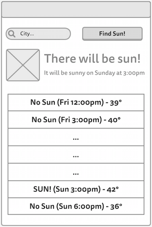

# SunSpotter
The Pacific Northwest in the winter is a gray and dreary place. So for this assignment, you will build a small mobile app that will let users find out if there will be any sun nearby in the future--and if so, when!


### Objectives
By completing this challenge you will practice and master the following skills:

* Creating new Android activities
* Defining complex layout using XML resources
* Using Android View elements, including composites
* Downloading data from the Internet
* Accessing and parsing data from public APIs using Java

## User Stories
The functionality of projects in this class&mdash;that is, the things you can do with an app&mdash;will be defined by [**user stories**](https://en.wikipedia.org/wiki/User_story). User stories are a technique from [Agile software development](http://en.wikipedia.org/wiki/Agile_software_development), and are short, plain-English descriptions of a single piece of functionality. Most apps can let the users do lots of things, and so may have lots of different user stories.

The user stories for the SunSpotter app are:
* As a user, I want to see if and when there will be any sun in the near future.
* As a user, I want to see a future weather forecast so I can plan to find the sun.
* As a user, I want to specify my location so I can see if there will be sunshine near me.


## Implementation Details
For this assignment, you will be creating a small app--but because it has "real-world" functionality, there are a lot of pieces that are involved in making even this simple system work!

### Fork and Create
As with all assignments, you should start by **forking** and **cloning** this repository. It includes any starter code plus the `SUBMISSION.md` file you will need to complete.

You will need to create a new project through Android Studio. Make sure to name your project **sunspotter**, so that the package is `edu.uw.uwnetid.sunspotter`. _You will need to save the project inside your cloned repo!_

Once again, target API 19 (4.4 KitKat) as your minimum SDK. You should start with a single empty Activity; you will need to build the layout from scratch.

### Layout and Appearance
Your SunSpotter app should run in a single Activity (screen), following the rough mock-up below:



At the top the user should be able to enter their zip code and hit a "Search" button. Beneath that there should be a view that shows whether there is going to be any sun in the next few days, and if so when that first sun will be. It should also show a picture for whether there is weather (e.g., a sun if there will be sun, clouds otherwise). Finally below that is a **scrollable** list of the tri-hourly forecast for the next few days, emphasis on whether there is sun or not.

Note that this is only a rough mock-up&mdash;any styling (color, etc) and other appearance details are up to you! But you should include all of the components indicated, in their relative positions.

In setting up your View, think about how you can divide this screen into _nested layouts_, and what kind of view components you should use for each part. You may also want to create multiple **layout resources** (XML files) to help keep your layout organized.

Finally, be sure and specify a **launcher icon** for your app. Android Studio has a nice sun clipart you can use :)


### User Input
In order to get user input, you'll need to use a [`EditText`](http://developer.android.com/reference/android/widget/EditText.html) View and a [`Button`](http://developer.android.com/reference/android/widget/Button.html) View. Define them in the XML resources, and then you can use the [`findViewById`](http://developer.android.com/reference/android/app/Activity.html#findViewById(int)) method to access these Views in your Java Code. You'll want to specify a method that is called when the button is clicked; you can do this in the XML _or_ in the Java code; see the Button documentation for details.

When the button is pressed, you'll need to <a href="http://developer.android.com/reference/android/widget/TextView.html#getText()">get</a> the zip code that was typed in, and if it's valid use it to check the weather (see below)
. Once you get some weather data, you should <a href="http://developer.android.com/reference/android/view/LayoutInflater.html#inflate(int, android.view.ViewGroup, boolean)"> inflate</a> the "middle" section (that gives the next time the sun will be out), and make sure that the forecast list is up to date.


### Checking the Weather
To make this not just a toy app, we're going to fetch actual weather data from the internet, using an API provided by [OpenWeatherMap.org](http://openweathermap.org/api). But in order to download this data, there are a lot of steps to go&mdash;but we'll be introduced to all kinds of Android concepts in the process!

#### OpenWeatherMap API
OpenWeatherMap provides a public API that we can send HTTP requests to, getting data back in `JSON` format (basically, we tell our application to go to a URL, and the "page" we get back is a formatted String). The URL we'll go to has a base url (`api.openweathermap.org/data/2.5/forecast`), followed by a `?` and then a list of additional _query parameters_ of the form `param=value`, joined by `&`. For example:

`http://api.openweathermap.org/data/2.5/forecast?q=Seattle`

Will send a request with the parameter `q` (for "query") with a value of `Seattle`&mdash;getting the weather for Seattle. See the [API docs](http://openweathermap.org/forecast5) for more details.

You can construct this URL simply by concatenating Strings together, but you might find it easier to use Android's [Uri.Builder](http://developer.android.com/reference/android/net/Uri.Builder.html) class to set the path, append query parameters, and finally build the URI.

One of the request parameters you'll need to send is an `appid`&mdash;a registered id that identifies you as a developer. You can get this id by [signing up for a free API key](http://openweathermap.org/appid). Then just include it in all of your requests.

**Protip**: you generally don't want API keys to be easily found in your source code (since they are kind of like passwords). So instead you can add it to the Gradle `build.gradle` file found in your `app`, and have it automatically get added to your code during compilation. To do this, add a new rule to the `android` section of the build file:

```gradle
buildTypes.each {
  it.buildConfigField 'String', 'OPEN_WEATHER_MAP_API_KEY', MyOpenWeatherMapApiKey
}
```
You can then access this build variable in your code via:

```gradle
BuildConfig.OPEN_WEATHER_MAP_API_KEY
```

#### Accessing the Network
Sending a request over a network in Java is fairly complicated: it involves opening up a `URLConnection`, and then reading each line from that `InputStream` in order to reconstruct the entire response. We will go over this process in lab (and provide sample code you can work from). The class you'll want to use is [`HttpURLConnection`](http://developer.android.com/reference/java/net/HttpURLConnection.html), combined with a [`BufferedReader`](http://developer.android.com/reference/java/io/BufferedReader.html) to read each line; a [`StringBuffer`](http://developer.android.com/reference/java/lang/StringBuffer.html) is an efficient way of building the response String.

##### Background Threading
If you try and use a simple connection like  this directly when the search button is pressed, you run into problems. The data connection you're establishing is _slow_; it can take a while to get a response back! If you just run it on the main **UI Thread**, it will effectively halt all user interaction while the data downloads... which can cause the phone to become unresponsive and the app to crash. So you will need to spawn a new thread to make this network call!

Luckily, handling this kind of **asynchronous task** is common in Android, so there are built-in classes to help us out. The easiest one to use for this app is called [`AsyncTask`](http://developer.android.com/reference/android/os/AsyncTask.html).

`AsyncTask` is `abstract`, so you will need to subclass it to use it:

```java
private class MyTask extends AsyncTask<Void, Void, Void> {
  //...
}
```
(The three types in the generics are the types you want the "asynchronous method" to take as a parameter, to report progress with, and to return. In this example, they're all `void`).

You can then fill in the abstract method `doInBackground()` with what code you want to run "in the background" (on a separate thread). You can also specify code to run `onPreExecute()` ("before" the new thread starts; on the UI thread) and `onPostExecute()` ("after" the new thread finishes; on the UI thread). This will let you make your network connection in the background, get the results (saving them to an _instance variable_, for example) and then use those results to modify the UI after the data is completed. We will review this process briefly in class.

**Helpful (?) Hint:** you may want to make a simple "wrapper" class (e.g., `ForecastData`) that can hold both the list of forecast Strings AND information about the "next available sunlight", which you can then use to modify your Views.

##### Permissions
Additionally, in order to access external data, you'll need to **request permission** from the user to use the internet. This is a security feature built into Android. Effectively, you specify that your app requires some extra functionality, and then the user has to explicit agree to allow that functionality in order to install your app.

These permission requests are specified in the **Android Manifest** file `manifest.xml`, found in `app/manifests/`. Add the following element to this file (e.g., about the `<application>` element):

```xml
<uses-permission android:name="android.permission.INTERNET"/>
```
Now your app will ask the user on install if it can pretty-please go on the Internet.


#### JSON Parsing
Once you've downloaded the response as a String, you'll need to extract the relevant weather data from it. While `JSON` format can automatically be turned into Objects in JavaScript, you need to do a bit more work in Java.

You can convert JSON Strings into Java Objects/Arrays using two classes: [`JSONObject`](http://developer.android.com/reference/org/json/JSONObject.html) and [`JSONArray`](http://developer.android.com/reference/org/json/JSONArray.html). The constructors for each of these classes take a JSON String, and you can call the `getJSONArray(key)` and `getJSONObject(key)` in order to get nested objects and arrays from inside a `JSONObject` or `JSONArray`. Again, we will provide sample code for this in class. This parsing is good practice working with Java objects!

If you look at the [example output](http://openweathermap.org/forecast5#JSON) from the OpenWeatherMap API, you can see that you'll be looking at the `"list"` of hourly forecast objects. Each object has a  `"dt"` that is the the UNIX time (in UTC, use the [`Date`](http://developer.android.com/reference/java/util/Date.html) and [`SimpleDateFormate`](http://developer.android.com/reference/java/text/SimpleDateFormat.html) classes to convert), a `"weather.main"` value that gives the weather (`"clear"` means sun!), and a `"main.temp"` value that gives the forecasted temperature.

These should provide you enough information to have the app report whether there is sun!


## Extra Features
The above should give you the basic set of functionality&mdash;and it's a lot to do for a simple program! However, if you're feeling really ambitious, you could add even more details, possibly earning extra credit on the assignment.

It's not too hard to have a `ListView` show more than a list of Strings, but instead to format each list item as its own complex view. You will need to create your own custom `ArrayAdapter` to deal with this; [this link](https://github.com/codepath/android_guides/wiki/Using-an-ArrayAdapter-with-ListView) has a good example.

You are of course welcome to show more detailed data if you wish. The OpenWeatherMap API includes ways to fetch even more data: for example, you can get the weather from a list of cities nearby to set of latitude/longitude coordinates (we'll talk more about accessing location from the phone later). If you're feeling really clever, you could try and geo-locate the given city name (e.g., using something like the [GeoNames API](http://www.geonames.org/export/web-services.html)), fetch a list of cities that surround that, and then query the forecast for each of those and compile all the data together. But that is well beyond the scope of this assignment.

## Submit Your Solution
In order to submit programming assignments in this class, you will need to both `push` your completed program to your GitHub repository (the one in the cloud that you created by forking), and submit a link to your repository to [Canvas](https://canvas.uw.edu/) (so that we know where to find your work)!

Before you submit your assignment, double-check the following:

* Test that your app builds, installs, and works without errors. It should fulfill all the user stories.
* Fill out the `SUBMISSION.md`included in the assignment directory, answering the questions.
* Commit the final version of your work, and push your code to your GitHub repository.

Submit a a link to your GitHub repository via [this canvas page](https://canvas.uw.edu/courses/1023396/assignments/3082080).

The assignment is due on **Tue Jan 19 at 6:00 AM**.

### Grading Rubric
See the assignment page on Canvas for the grading rubric.


_Adapted from an assignment by Google._
